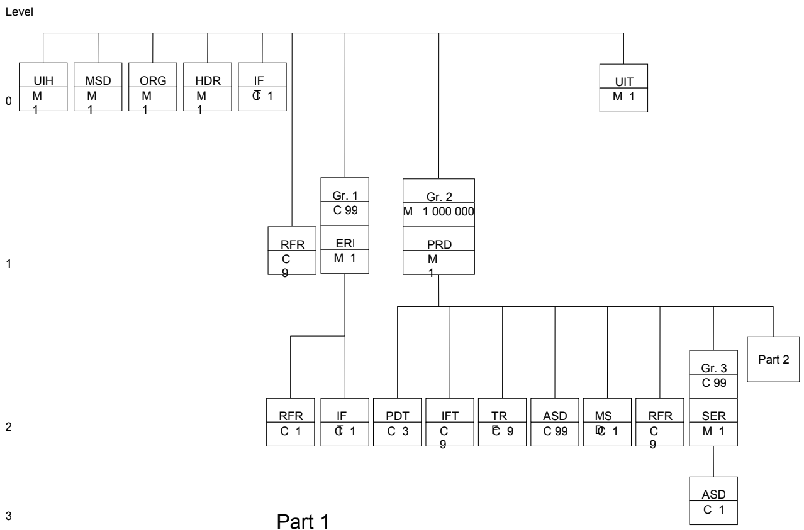
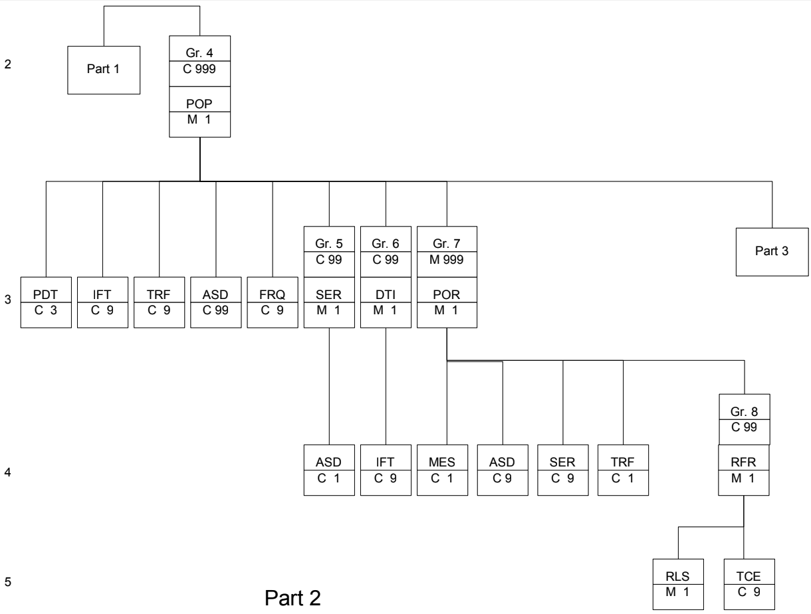
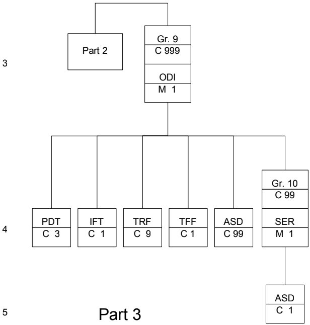
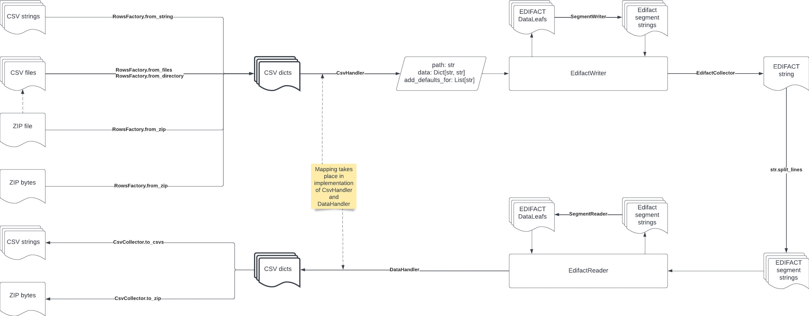
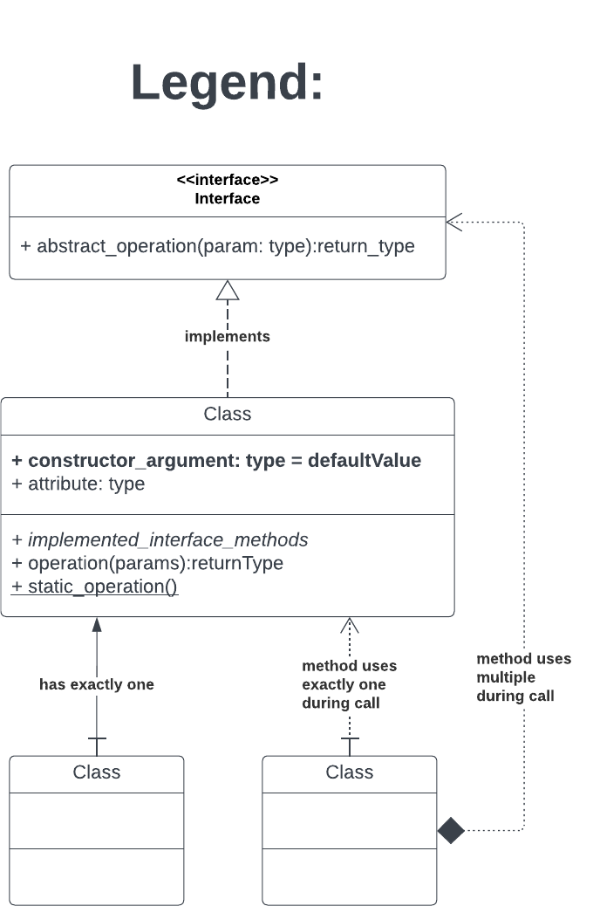
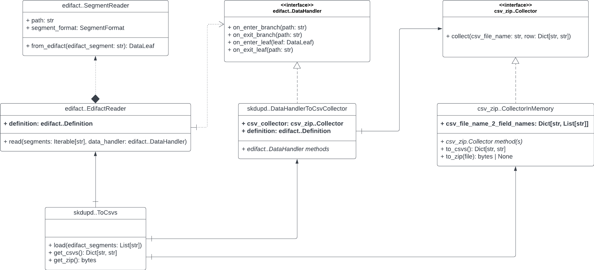
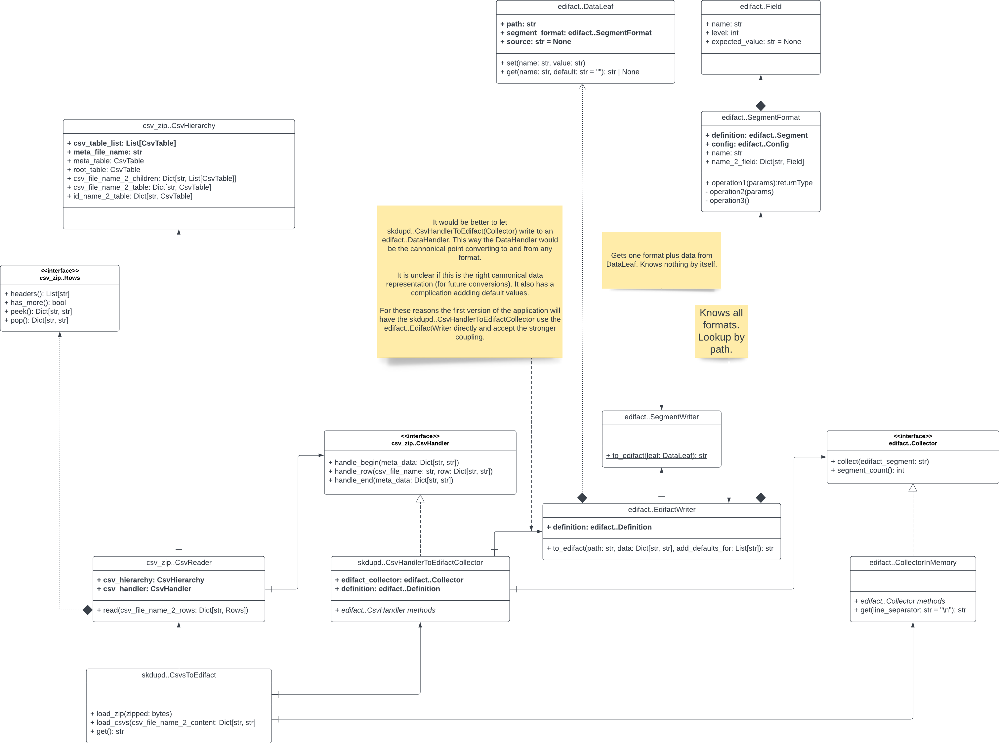
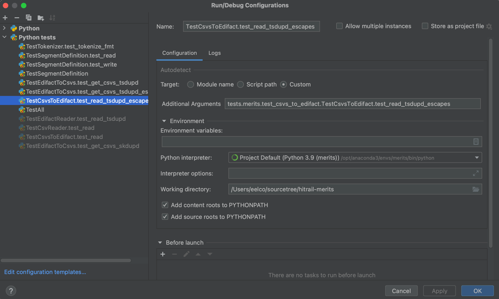
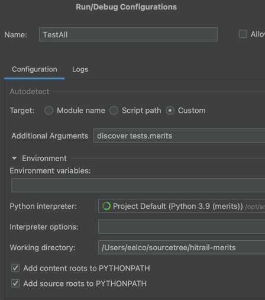

# Development Guide

This documentation is intended for developers who work on this "MERITS Conversions" library.

## Quick Start

Do you want need to see or modify the mapping between EDIFACT and CSVs? Then look in the `merits.skdupd`
and `merits.tsdupd` packages for `csv_handler_to_edifact_collector.py` and `data_handler_to_csv_collector.py` files.

Do you want to update the file format definitions? Then look in the `merits.skdupd` and `merits.tsdupd` packages
for `definition.py` and `csv_model.py`. (Updating the definitions ofcourse has consequences for code that uses it.)

For a general introduction and more complex changes, read on.

## Introduction to EDIFACT

EDIFACT is a text based format. See for examples the `*.r` files in
the [test examples directory](../tests/EDIFACT_examples).

- Each line is called a segment.
- The first three (always upper case) characters are the segment name.
- Each segment ends with terminator character `'`.
- Parts of a segment are separated on three levels indicated from high to low by separator characters `+`, `*`,
  and `:`. (Officially `*` is a repetition indicator instead of a separator but this application does not support full
  repetition.)
- Segments are ordered according to a tree structure. More on this below.
- Segments with the same name may occur at different nodes in the structure (and these segments may have different
  fields/formats).

### Tree Structure

EDIFACT files adhere to a structure that determines in which order segments can occur. For SKDUPD this is shown in the
images below.

In each node the segment name is in the top half.

In the bottom half of the node `M` means mandatory and `C` conditional. A number may indicate the maximum number of
occurrences.

Segments on the same level occur in the order reading from left to right. Conditional segment may be absent in the
EDIFACT file.

If the node is a group instead of a segment, then the group number is shown in the top half of the node.

The first child of a group is always a mandatory segment. In the images it is shown attached under the group node. In
the EDIFACT files a group start is only indicated by the occurrence of the first child. A group end is only indicated by
the occurrence of a segment that can only be reached by leaving the group.

The structures for SKDUPD and TSDUPD are given in their respective `definition.py` files.

Each node has an ID that is unique in the structure. In almost all code we point to a node by path instead. For example
in SKDUPD the node with path "2_PRD/4_POP/7_POR/POR" has node ID "0360". The group numbers are suffixed with the name of
the first child for human readability. For the same reason we use paths instead of node IDs.

### Segment Format

The official documentation/leaflet uses four character tags in the definition of a segment. In this project we use named
fields and write the complete format in a form that strongly resembles the looks of the segment itself. This makes the
conversions more understandable for human developers.

See the documentation in the code of `merits.edifact.definition_model.Segment.format` for more details.

## Flow

In the diagram below the conversions flows are shown in high level. The names of the arrows indicate the classes and
sometimes methods that do the step in the conversion.

You can start in the upper left side with one of four CSV source types. These are read into one dict per row and per CSV
source file. Rows are mapped to multiple data elements for creating one EDIFACT segment each. The segments are
concatenated to form an EDIFACT file as one string. This completes conversion to EDIFACT. (The image continues to a
round trip.)

You can start in the upper right corner, with an EDIFACT file. Split the file into lines using the python standard
library. The EdifactReader converts one segment line at a time and pushes it to a DataHandler. The DataHandler maps
multiple segments to single CSV dicts that each represent a row. These are collected and available as a single string
per file or as bytes of ZIP.

## Class diagrams

For the visual 'readers' class diagrams are shown below.

We will start with a legend explaining symbols and type facing use.

The interfaces and classes for conversion from EDIFACT to CSVs are shown below. Note that only two classes are specific
to, in this case, SKDUPD. The rest is generic.

For the conversion from CSVs to EDIFACT the interfaces and classes shown below are used. In this diagram the upper half
shows internal data representations. Some of these are also used in the other conversion but were not shown in the
diagram above.

## Testing

The tests directory contains unit tests.

To run all tests from the command line. Change directory to the root of this project. Then
run `python -m unittest discover tests.merits -v`

The tests directory contains an [__init__.py](../tests/__init__.py) that adds the `src` directory to the python path.

A common pattern in the tests is to

1. load from the [test examples](../tests/EDIFACT_examples) a source file
2. convert it using an object that we are testing
3. write the actual results to `*-actual.*` file(s)
4. load the expected output(s) from file(s)
5. and compare the actual results to the expected outputs.

If actual and expected differ, you then have the files to examine the difference. (Actual files are git-ignored.)

Coverage is mostly at the library's top level: CSVs to EDIFACT and the other way around.

PyCharm makes working with a separate tests directory a bit complicated. The screenshots below show run configurations.

